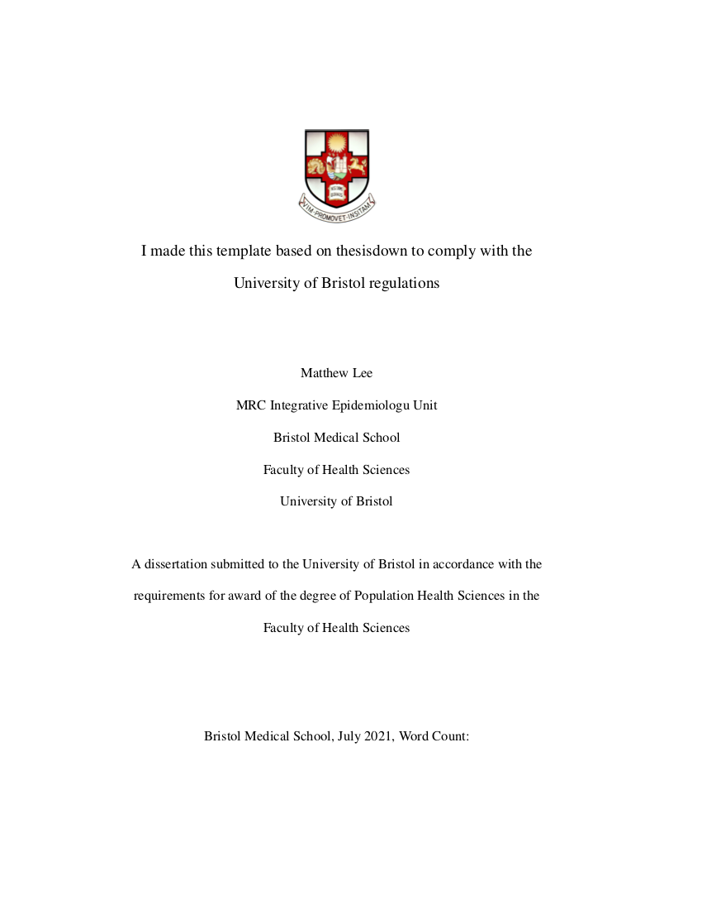
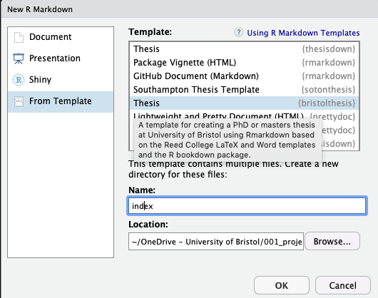

# bristolthesis

This is a modified version of [`thesisdown`](https://github.com/ismayc/thesisdown) to be compatible with the [University of Bristol reserach degree regulations](http://www.bristol.ac.uk/directory/exams/research-degree/your-dissertation/). The updates are mainly around the ordering of sections and spacing/font sizing.




The PDF and HTML (gitbook) versions work pretty well. The word version is hit or miss and really should only be used if you want to get comments/feedback from supervisors etc..

You should follow the [`thesisdown`](https://github.com/ismayc/thesisdown) guide and when it comes to it you should then install `bristolthesis`:

```{r}
# Install devtools
install.packages("devtools")
library(devtools)

# Install bristolthesis directly from GitHub
devtools::install_github("mattlee821/bristolthesis")
library(bristolthesis)
```

In `RStudio` (you may need to restart it first) go to new file, R Markdown, from template, bristolthesis. You *must* give it the name **index** or it will not work. `knit` the `index.Rmd` file and it will pull the guide up.



## Important stuff 

### Set-up
I put all of my figures that I wanted to use in the `figure/` folder and then within individual chapter folders. I did a similar thing with any data I wanted to use by using the `data/` folder and then using chapters within that.

### help / advice

* [figures](https://bookdown.org/yihui/bookdown/figures.html)
* [tables](https://bookdown.org/yihui/bookdown/tables.html)
* [`kableExtra`](http://haozhu233.github.io/kableExtra/awesome_table_in_html.html)
* [`flextable`](https://davidgohel.github.io/flextable/articles/overview.html)
* [cross-referencing](https://bookdown.org/yihui/bookdown/cross-references.html)


### Microsoft word and tables
If you want to `knit` to word and pdf/HTML interchangeably then there might be issues with tables specifically. To get around this I make tables for html/pdf using `kable` and `kableExtra` and for word I use `flextable`. The issue here is that `R Markdown` needs to know what document you are knitting to. To tell it you should include `doc.type <- knitr::opts_knit$get('rmarkdown.pandoc.to')` at the top of your `index.Rmd` file and just for safety (and if you want to knit individual chapters) at the top of each `.Rmd` file. You can then use an `ifelse` statement to produce tables:

```{r}
if(doc.type == "docx"){
}else{
}
```

## Tips

### Remove page numbers
Soemtimes a figure will take up a whole page, or maybe your figure caption overlaps your page number. To remove the page number:

```
\newpage
\thispagestyle{empty}
```

This will create a new page and then give that page an empty style which means it has no page number. You can now have your figure code diretcly after this code. The next page will be numbered appropriately, i.e. if the page with no number is 11 the next page will be 12.

### Figure captions
Figure captions can be made outside of the figure with an internal reference. For example we have a figure called `figure.pdf` and we want it to have a figure caption that is printed with the figure, but we also want a figure title in our table of figures. Our figure caption is too long to go in the table of figures. So we use the `fig.cap` and `fig.scap` arguments in the `knitr` block. The benefit of using an internal reference as below means we can reference within the figure caption if we want.

`(ref:figure-caption-cap) **This is my figure title**. This will be printed with the figure. But it will be too long to go in the table of figures. Using an internal reference means we can embed a reference in this caption though[@r20201]`

`(ref:figure-subcaption-scap) This is my figure title`

```{r figure, echo=FALSE, out.width='100%', fig.cap='(ref:figure-caption-cap)', fig.scap='(ref:figure-subcaption-scap)'}
knitr::include_graphics("my/figure.pdf")
```


